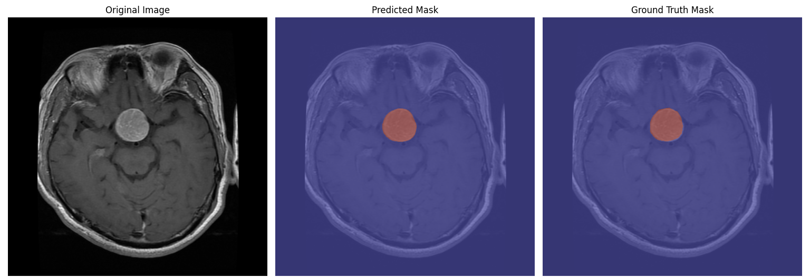
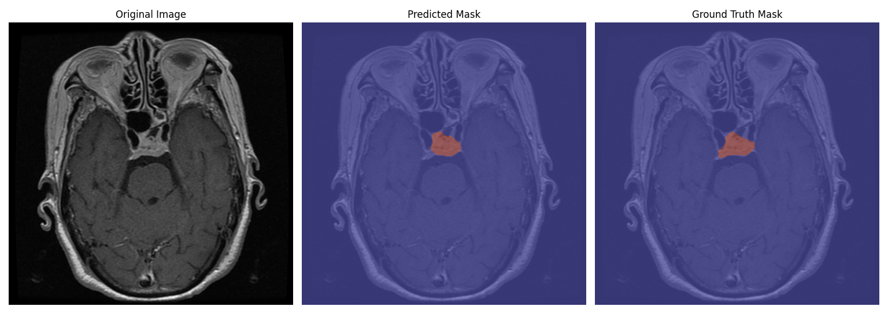
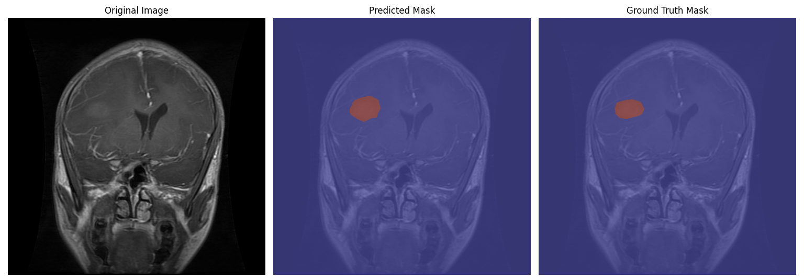

# Brain Tumor Segmentation

This project focuses on developing a **deep learning model** for *semantic segmentation* of brain tumors from MRI scans. The goal is to experiment with different segmentation architectures, loss functions, and training setups to accurately detect and segment tumor regions.

## Version 3 (Work in Progress)

Version 3 (v3) is currently under development.
- It will build on the already **working and high-performing v2**, which achieved strong segmentation results and clean visual outputs.  
- The new version will focus on **better organization and modularity**, with separate folders for models, training, datasets, and utilities to make the pipeline easier to extend and reproduce.

> If you want to check out the earlier versions (v0, v1, v2), their architectures, comparisons, and output results, see the **`archived_models/`** folder.
> Each archived notebook contains the complete model, dataset setup, and training process.

### Model 2 outputs:





## Objective

The main goal is to design a model that can **accurately segment brain tumor regions** while maintaining robust generalization across different scans.
#### Future work in v3 focuses on:
* Better data preprocessing and augmentation.
* Cleaner modular code structure.
* Improved training stability and loss design.

## Dataset

This project uses the [Brain Tumor Segmentation Dataset](https://www.kaggle.com/datasets/nikhilroxtomar/brain-tumor-segmentation?select=images), which includes paired MRI images and binary masks (tumor vs background).

## Project Structure (v3 goal)

```
Model V3/
 ├─ data/
 │   ├─ dataloaders.py
 │   └─ datasets.py
 ├─ experiments/
 ├─ training/
 │   ├─ trainer.py
 │   ├─ training_loop.py
 │   └─ losses.py
 ├─ model outputs/
 │   └─ visualize_output.py
```

## Future Work


* [x] Archive previous versions for comparison.
* [x] Improve boundary precision (e.g., boundary loss, architectural tweaks).
* [ ] Finish modular v3 implementation.
* [ ] Deploy the model on Hugging Face or another hosting service.
* [ ] Cross-dataset validation to evaluate generalization..
* [ ] Consider `Attention U-Net` or `Swin-UNet` for future experiments.

