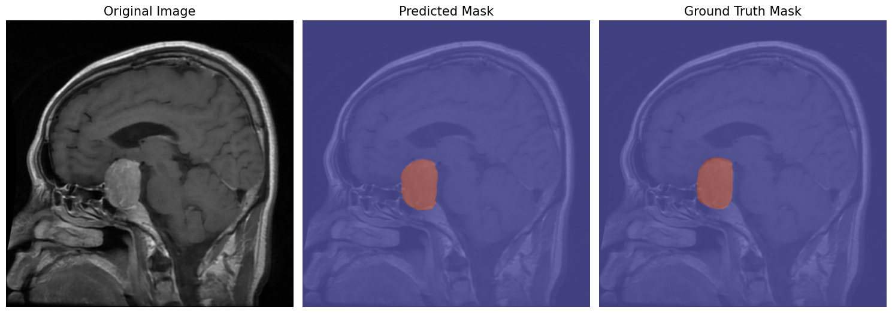
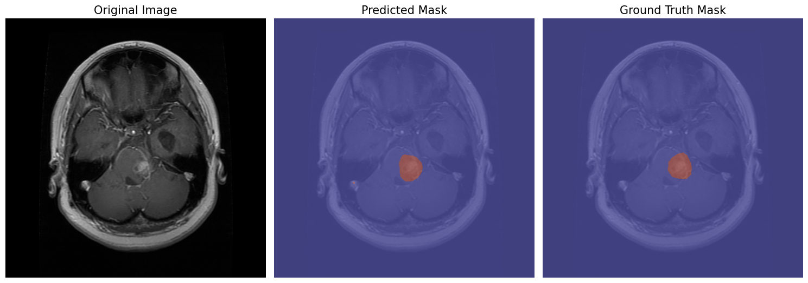
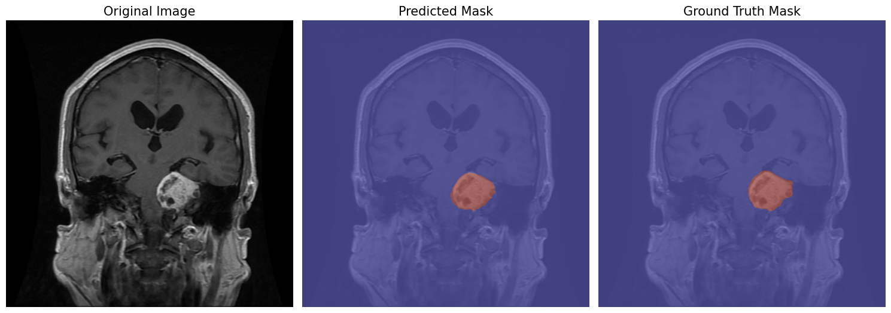

# Brain Tumor Segmentation

This project focuses on developing a **deep learning model** for *semantic segmentation* of brain tumors from MRI scans. The goal is to experiment with different segmentation architectures, loss functions, and training setups to accurately detect and segment tumor regions.

## Version 3 (Completed)

Version 3 (v3) is now **fully implemented**.

It builds on the already **high-performing v2**, which produced strong segmentation results and clean visual outputs.

The new version features **highly optimized, modular, and reproducible pipeline**, making it significantly faster in training and much easier to reproduce or adapt for **any MRI segmentation problem**, not just brain tumors.

To train the model on a new dataset, simply update the dataset directory in the training pipeline (`Model V3/train.ipynb`).

> You can find earlier versions (v0, v1, v2) in the **`archived_models/`** folder.
> Each notebook there contains the full model, dataset setup, and training process for comparison.

### Model 3 outputs:




### Metrics
- Average validation losses = **0.287**
- Dice Score: **0.7582**
- Hausdorff Distance: **39.5141**

## Objective

The main goal is to design a model that can **accurately segment tumor regions** in MRI images while maintaining robust generalization across different medical datasets.

Version 3 focuses on:

- Modular, reproducible code.
- Dataset-agnostic pipeline design.
- Improved augmentation and loss handling.
- Easier visualization and experimentation.

## Dataset

This project originally used two Brain Tumor Segmentation Datasets:

- [Brain Tumor Segmentation, by Nikhil Tomar](https://www.kaggle.com/datasets/nikhilroxtomar/brain-tumor-segmentation?select=images)
- [Brain Tumor Segmentation Dataset, by Zarin Usha Shams](https://www.kaggle.com/datasets/zarinushashams/brain-tumor-segmentation-dataset?resource=download)

Both provide paired MRI images and binary masks (tumor vs background), totaling **6,814** (image, mask) pairs.

## Project Structure (v3)

```
Model V3/
 ├─ data/
 │   ├─ dataloaders.py
 │   └─ datasets.py
 ├─ experiments/
 ├─ training/
 │   ├─ trainer.py
 │   ├─ training_loop.py
 │   └─ losses.py
 ├─ model outputs/
 │   └─ visualize_output.py
 ├─ train.ipynb
 └─ model.py
```

## Next Steps

- [x] Archive previous versions for comparison.
- [x] Improve boundary precision (boundary loss, architecture tweaks).
- [x] Implement modular v3 pipeline.
- [x] Make v3 dataset-agnostic for any MRI segmentation.
- [ ] Deploy the model on Hugging Face or another platform.
- [x] Perform cross-dataset validation to test generalization.
- [ ] Explore `Attention U-Net` and `Swin-UNet` architectures in future work.


