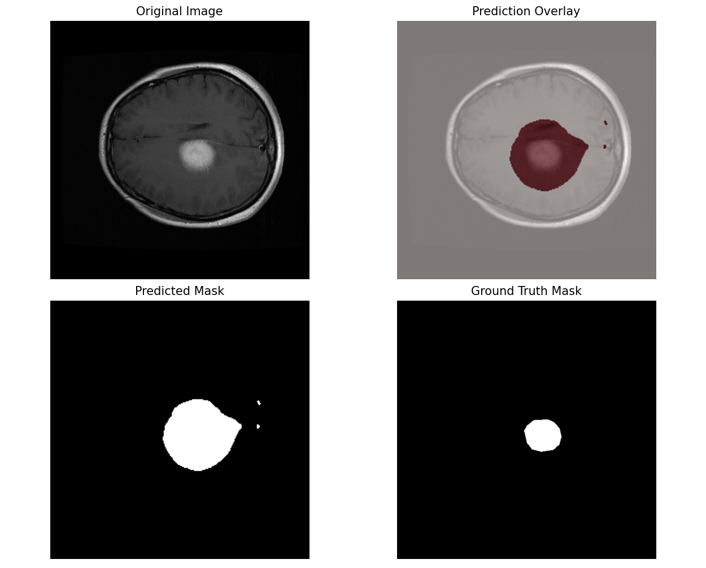

# Brain Tumor Segmentation

This project focuses on developing a **deep learning model** for semantic segmentation of brain tumors from MRI scans. The aim is to experiment with state-of-the-art segmentation architectures and refine them to achieve high accuracy in identifying tumor regions.

### Announcement — Version 2 (v2)
This repository now includes a second version (v2) of the segmentation pipeline. v2 focuses on transfer-learning with DeepLabV3 (ResNet-50) and pipeline improvements (see "What's new in v2" below). Work continues iteratively; training metrics for v2 will be populated here after experiments complete.

### Sample Output

## What's new in v2 (high level)
- Switched to `torchvision's DeepLabV3` (ResNet-50) with pretrained weights for transfer learning.
- Adapted the model to single-channel (grayscale) MRI slices by replacing the first convolutional layer.
- Replaced classifier and auxiliary heads to produce two output channels (background vs tumor).
- Backbone parameters are frozen initially to speed up convergence and reduce overfitting risk.
- Introduced a concise, reproducible transform pipeline for grayscale images.
- Implemented a custom PyTorch Dataset that aligns image/mask pairs and binarizes masks.
- Integrated MONAI's DiceLoss and DiceMetric for segmentation-specific training and evaluation.
- Enabled Automatic Mixed Precision (AMP) and a ReduceLROnPlateau scheduler.
- Training/validation loops are managed via a modular `going_modular.engine` for cleaner code and checkpointing.
- Corrected the Dice score implementation to ensure it is properly calculated and bounded between 0 and 1.

## Objective

The primary goal is to train a model that can **accurately detect and segment tumor subregions** from MRI slices. This involves:

* Exploring and understanding relevant brain tumor datasets (e.g., BraTS).
* Implementing and comparing segmentation architectures such as U-Net and DeepLabV3.
* Optimizing model performance through experiments with loss functions, learning rates, and data augmentation techniques.

## Dataset

This project uses the [Brain Tumor Segmentation Dataset](https://www.kaggle.com/datasets/nikhilroxtomar/brain-tumor-segmentation?select=images), which contains MRI brain image–mask pairs.

* **Images**: 2D MRI slices.
* **Masks**: Binary masks where white pixels indicate tumor regions.

## Workflow

The workflow is documented in the notebooks:
- `Brain_tumor_seg.ipynb` — original baseline experiments (v1).
- `Brain_tumor_seg_V2.ipynb` — transfer-learning experiments and updated pipeline (v2).

Main steps:
1. Data loading & preprocessing — reading, resizing, converting to grayscale, normalizing.
2. Model definition — adapting pretrained DeepLabV3 or other architectures.
3. Training — using Dice-based loss and optimizer/scheduler.
4. Evaluation — computing Dice and visualizing predictions.

## Results (placeholders for v2)
- Final Validation Accuracy:
- Best Dice Coefficient:

(These fields will be filled once v2 training and evaluation are completed.)

## Results from v1 (historical)
- **Final Validation Accuracy:** 90.81%
- **Best Dice Coefficient:** Not reported due to a calculation error in the v1 implementation. This issue is resolved in the v2 pipeline.
- **Summary:** The v1 experiments successfully established a U-Net baseline and a functional data pipeline. Detailed logs are available in the original `Brain_tumor_seg.ipynb` notebook for reference.

## Project Status & Future Work

This project has demonstrated baseline segmentation approaches. Next steps and ideas:

- [ ] Improve boundary precision (e.g., boundary loss, architectural tweaks).
- [ ] Deploy the model on Hugging Face or another hosting service.
- [x] Experiment with other pretrained segmentation models for comparison:
  * DeepLabV3, FCN, LR-ASPP
- [ ] Explore advanced architectures like Swin-UNet or Attention U-Net.

- [ ] Cross-dataset validation to evaluate generalization.
~~- [ ] Extend to 3D volumetric data (full BraTS 3D volumes).~~

---
